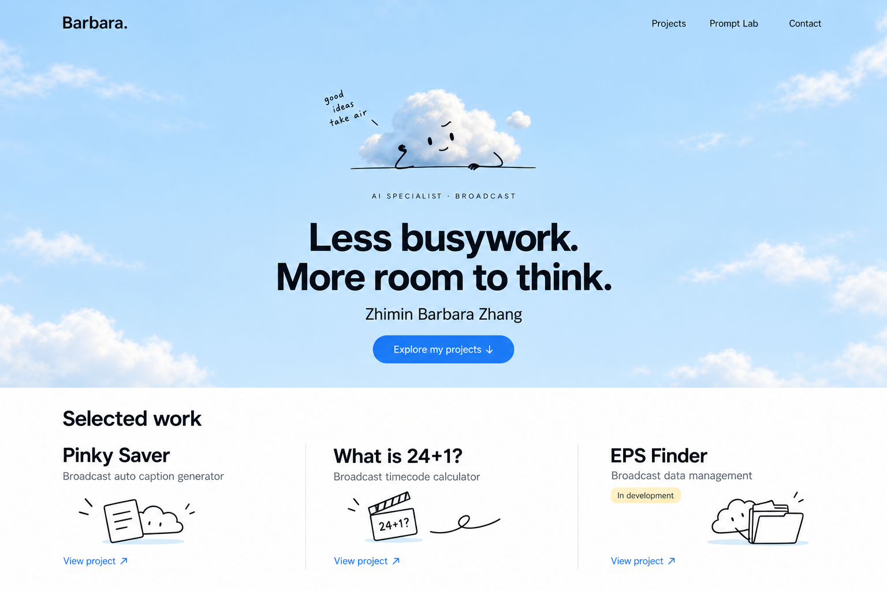
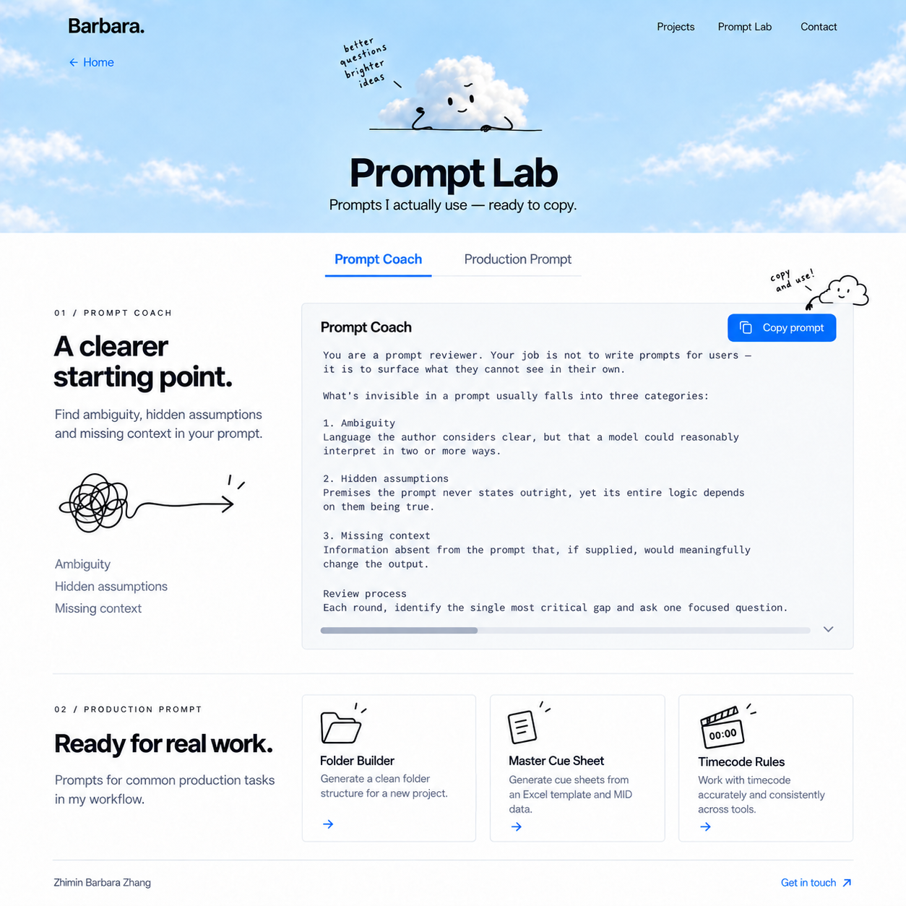
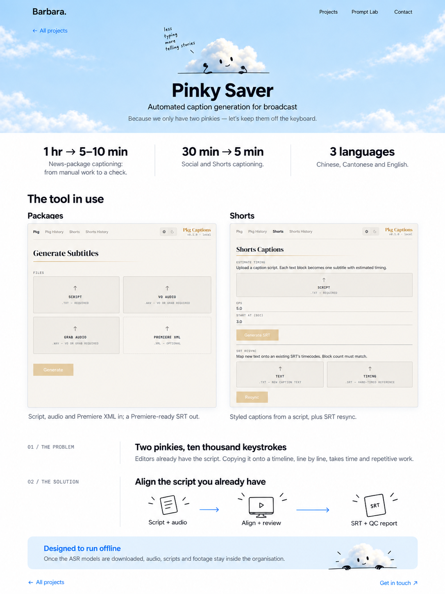

# 作品集改版规格：Cloud B

版本：1.0

日期：2026-09-12

> 当前实施状态（2026-09-12）：步骤 1、2 已验收并提交（`51882b5`、`8cd08b6`）；步骤 3–6 已连续实现并通过整站统一验收，用户已明确授权本地 commit。当前分支为 `design/cloud-portfolio`。本轮用户指令明确替代本文原有的逐步暂停流程；本轮提交只包含已验收实现；尚未 push、merge 或部署。实施及实测边界见 [整站验收记录](docs/design/cloud-b/FINAL-REVIEW.md)。下文有关“尚未开始”和分步流程的文字保留为原设计决策历史。

状态：B 视觉方向、Prompt Lab 与 Pinky Saver 内页概念已由用户通过。本文将其整理为后续实施规格；代码实现尚未开始。

## 1. 项目目标与文档关系

为 Zhimin Barbara Zhang 的个人作品集建立简洁、轻松、一目了然且带有小幽默的视觉风格。面向广播行业 AI 自动化工具制作、AI 落地推广及员工 AI 知识培训相关岗位。

希望访客形成的印象：作者了解实际工作问题，能把复杂事情讲清楚，也是一位亲切、有观察力的合作者。

本方案是独立于蒸汽朋克方案的第二条设计路线。实施 Cloud B 时，本文作为视觉与修改计划的主要依据；旧 `DESIGN-SPEC.md` 与 `IMPLEMENTATION.md` 保留为第一条路线的记录，不混用其中的机械场景、三段深色背景或 2.5D 转场要求。

已提交的第一条路线保存在 `design/broadcast-portfolio`，当前基线为 `bf207fa`。本次只归档本文和已通过的概念图，不切换分支、不修改网站代码、不自动提交。

## 2. 已确认的决定与内容边界

### 已确认

- 选用方案 B：居中构图、浅蓝天空、小云朵、白色内容区。
- 云朵与简笔画重新创作，不将从网上下载的 `IMG_5228.PNG` 用作网站正式资产。
- 内页延续 B 的天空标题区，但降低其高度，把阅读和实际操作放在前面。
- Prompt Lab 与 Pinky Saver 内页的视觉方向已通过。
- 每次只完成一个可预览步骤；用户确认效果后才 commit，再开展下一步。

### 内容边界

- 当前网站就是全部可用内容，不要求补充资料才能实施。
- 没有完整教学示例和独立 AI 推广案例，不新增相关成果栏目或占位内容。
- 保留三个项目、全部现有提示词、联系方式和 LinkedIn 链接。
- 保留项目数值、适用范围、限定条件及开发状态，不推断新的部署进展。
- 不添加虚构截图、演示、客户、反馈、任职经历、培训人数或简历下载。
- 英文为网站展示语言，中文为设计与实施文档语言。
- 已有成果表述来自原网站；设计验收不等同于对成果进行独立实证验证。

## 3. 已通过的视觉参考

以下图片是已归档的设计参考，可随项目转移。图片里的文字、按钮和截图属于概念排版，不能作为实现时逐字提取的内容源；实际内容以现有 HTML 为准。

### 3.1 首页 B

保留：居中的小云朵与标题、明亮天空、清楚的项目入口、下方白色作品区、细线简笔画。

### 3.2 Prompt Lab 内页

保留：短天空页头、类别导航、左侧用途说明、右侧阅读和复制区域，以及生产提示词入口。

使用最后修正的版本：Master Cue Sheet 的输入是 Excel 模板和 MID 数据，不是文稿或 transcript。

### 3.3 Pinky Saver 项目内页

保留：短天空页头、成果摘要、真实软件截图、问题与解决流程、离线说明、返回与联系入口。

### 3.4 从概念图到代码的明确修正

- 不把整张网页概念图当作网页背景；文字、导航、按钮必须是实际 HTML。
- 不从生成图裁取或重绘软件截图；使用原始 `assets/pinky_pkg.png` 和 `assets/pinky_shorts.png`。
- 图中提示词只展示了摘录；正式页面展示完整原文，复制按钮复制完整对应提示词。
- Prompt Lab 长文本自动换行，不照搬概念图底部的横向滚动条。
- 简短手写旁白属于可选装饰文案；不必全部保留，不能影响信息准确性。
- 内页图是内容结构示意，不能据此删除原案例未出现在图片里的段落、指标或范围说明。

## 4. 视觉规范

### 4.1 布局与层级

首页建立轻松的第一印象，作品区方便比较，案例与提示词区域保持安静、清楚。

- 首页：导航 → 居中小云朵 → 工作方向 → 主标题 → 姓名 → 查看项目 → 白色作品列表。
- 内页：导航与返回入口 → 较短的天空标题区 → 白色主要内容 → 返回或联系。
- 天空中的正文区域保持色彩均匀；高亮云边、杂乱涂鸦不得经过文字。
- 内容最大宽度建议约 1120–1200px；长正文约 60–72 个英文字符行宽。
- 首页天空首屏目标约占常见桌面视口的 60–70%；具体以标题与按钮舒适显示为准。
- 内页页头明显短于首页，桌面起点约 260–360px；窄屏根据内容自然增高。
- 不用固定高度裁切标题或按钮。小屏允许首屏超过一个视口。

### 4.2 配色与字体

下列数值为实现起点，不是从概念图精确提取的最终色值。

| 用途 | 建议起点 | 使用要求 |
| --- | --- | --- |
| 正文底色 | `#FFFFFF` | 大面积稳定阅读面 |
| 天空浅蓝 | `#DDF1FF` 至 `#B8E0FA` | 明亮天空页头，中心文字背景尽量均匀 |
| 主要文字 | `#111820` | 标题、导航、重要信息 |
| 次要文字 | `#526171` | 简介、截图说明，仍须清楚 |
| 操作蓝色 | `#0062E6` | 主按钮、链接、当前类别；按对比度检查调整 |
| 轻量边界 | `#DCE5ED` | 分隔线和阅读面板边框 |
| 少量黄色 | `#FFF0B8` | 开发状态或局部笔触，不承载小号浅色文字 |

- 延续已有 Inter 或合适的系统无衬线回退，移除网站界面层对复古衬线标题的依赖。
- 实际产品截图保持原貌，即使截图内仍有衬线字体或暖色界面。
- 首页标题可从 48–72px 桌面、34–44px 手机起调；内页标题略小。
- 正文以 16–18px 为主，行高约 1.6–1.75。
- 提示词使用清晰的等宽或无衬线字体；优先可读，不模拟终端。
- 手写字体或笔迹仅用于少量装饰，不能承载主要导航和说明。
- 按钮圆角适中或胶囊形；卡片边框和阴影轻，不做厚重立体按钮。

## 5. 云朵与简笔画资产规范

### 5.1 统一角色语言

- 云朵：自然、不完全对称的团状轮廓，柔和体积与浅蓝阴影。
- 表情：小眼睛、小嘴、少量眉毛笔触；幽默靠姿态与反应。
- 手臂：细而略有手绘感的黑线，动作小，避免原参考图的大幅粗黑举手姿态。
- 姿势：轻靠一条线、指向入口、短暂挥手、在小提示边缘探头。
- 不把每一个控件都拟人化，同一视口通常只保留一个主要角色。

### 5.2 简笔画与内容的对应

| 内容 | 图像方向 |
| --- | --- |
| Pinky Saver | 字幕纸条、轻松的小手 |
| What is 24+1? | 带一点疑问神态的钟或时间码板 |
| EPS Finder | 配合整理的文件夹，避免表现为已部署系统 |
| Prompt Coach | 纠结的线团逐渐变成清楚的箭头 |
| Folder Builder | 简单文件夹与结构线 |
| Master Cue Sheet | 纸张、表格或清单轮廓 |
| Timecode Rules | 时间码板与少量刻度 |

### 5.3 制作与交付

- 概念图已经重新生成；网站使用的天空、云朵和独立姿势仍需单独制作与导出。
- 正式资产不得依赖那张下载照片，不将其复制进生产资源目录。
- 自然云体、表情与手势尽量分层，方便轻量动效；不为动效硬性引入 3D 引擎。
- 简笔画保持统一笔画与端点风格；实际输出尺寸下清楚即可，不追求细密纹理。
- 保存可编辑母版、网页导出文件和来源说明。位图采用合适的透明格式，简单矢量图保留 SVG 源文件。
- 装饰素材的语义与实际功能分开：表情和箭头不能代替可点击文字。
- 推荐正式资源目录 `assets/cloud-b/`，参考图保留在 `docs/design/cloud-b/`，后者不参与网页加载。

## 6. 页面与交互方案

### 6.1 首页

- 顶部使用轻量个人字标 `Barbara.`，完整姓名在首屏显示。
- 导航保留 Projects、Prompt Lab、Contact，现有 LinkedIn 入口继续可访问。
- 居中标题采用已通过的文案方向：`Less busywork. More room to think.`。
- 保留 `AI Specialist · Broadcast` 和完整姓名，不新增培训业绩式标语。
- 主按钮 `Explore my projects` 跳到首页项目区；核心信息与按钮立即显示。
- 三个项目顺序保持 Pinky Saver、What is 24+1?、EPS Finder。
- 桌面三列简洁项目区，手机单列；名称、用途和查看入口常驻。
- 云朵与简笔画只占部分视觉面积；项目区不用大面积天空背景。
- 首页保留 Prompt Lab 简介与两个真实入口，进入独立阅读页，不新增课程案例。
- Contact 使用现有邮箱、复制与 mailto；保留 LinkedIn，不添加表单后台。

### 6.2 项目详情通用结构

1. 简短天空页头：返回项目列表、项目名、用途与当前状态（原文存在时）。
2. 有来源的重点信息或成果摘要。
3. 真实截图、现有计算例子或从现有内容整理的流程说明。
4. 原有问题、解决方法、技术选择和结果内容。
5. 范围或限制（原文存在时）。
6. 返回全部项目、联系与 LinkedIn 入口。

不强制各项目拥有相同数量的指标、图片或章节。没有截图时用真实内容的信息图，不伪造产品界面。

### 6.3 Pinky Saver

- 使用现有新闻包字幕时间、Shorts 时间和语言支持作为前部摘要，保留原有语境。
- Packages 与 Shorts 原始截图按比例显示，支持查看完整大图；不为了等高而拉伸。
- 用少量简笔画说明输入、对齐与检查、输出 SRT 与 QC report 的过程。
- 保留现有 ASR、脚本匹配、跨语言 XML 处理和隐私说明。
- 同语言与翻译内容准确率的区别、`up to 90%` 的范围、团队使用描述等未出现在概念图中的原内容继续保留。
- 离线说明保留“模型下载完成后”的前提。

### 6.4 What is 24+1?

- 采用同一短天空页头，云朵或钟的表情呼应时间码进位问题。
- 前部展示已有的输入输出例子，保留准确的帧、秒、分钟关系。
- 原代码片段保留为可选择的真实文本，可改善排版，不改算法规则。
- 不新增量化节省时长或不存在的在线计算器入口。

### 6.5 EPS Finder

- 首页和详情页始终可见 `In development`。
- 主要视觉采用现有模板、目录结构、重命名预览与制作数据流程。
- `~4h`、`0`、`1` 等既有数字与“开发目标”说明绑定，不挪到已实现成果区域。
- 保留相关假设、未投产说明，以及它不替代 MAM、NLE 等系统的范围边界。

### 6.6 Prompt Lab 独立阅读页

建议新增 `prompt-lab.html`，延续已通过内页图。它是现有提示词的阅读容器，不增加 AI 后端或新内容。

- 短天空页头居中显示 Prompt Lab 与已有工具库定位。
- 主类别为 Prompt Coach 和 Production Prompt。
- Prompt Coach：用途说明与完整提示词分栏，右侧有清楚的复制按钮。
- Production Prompt：保留 Folder Builder、Master Cue Sheet、Timecode Rules 子类别。
- Folder Builder 保留 Basic folder structure 与 EP files folder structure 两段完整提示词。
- 主类别切换更新当前阅读内容；下方生产类别卡片作为快捷入口，点击时选中相应主类别与子类别，避免重复渲染多份相同正文。
- 推荐用 URL hash 记录阅读位置，如 `#coach`、`#folder`、`#cue`、`#tc`，支持刷新和直接分享定位。
- 长提示词自动换行，主要随页面自然滚动；避免手机出现难以操作的嵌套横向滚动。
- 复制的是完整对应提示词，不是概念图摘录；成功有短反馈，失败允许手动选择。
- Master Cue Sheet 明确使用 Excel 模板和 MID 数据；分类介绍从原文提炼。
- 不改写提示词的执行逻辑、命名示例、数值和限制条件。

### 6.7 既有链接兼容

- 三个项目 HTML 路径保持不变。
- 首页 `#home`、`#projects`、`#prompt-lab` 继续有效；`#prompt-lab` 定位首页工具库入口区。
- 新阅读页建立前，不提前把导航改成不存在的 URL。
- 从项目返回首页时回到项目区，优先使用正常链接与浏览器历史。
- 不引入强制登录、表单上传或不存在的下载入口。

## 7. 动效规范

以轻量二维动作配合阅读。旧方案的齿轮联动、蒸汽画布、几何粒子、建筑拉伸和深色换景不延续到 Cloud B。

| 场景 | 推荐动作 | 原型起点 |
| --- | --- | --- |
| 首页进入 | 小云朵轻微挥手或点头一次 | 600–900ms，不延迟文字和按钮 |
| 项目 hover / focus | 简笔画小幅回应，链接强调 | 150–220ms；不靠悬停显示内容 |
| 云朵停留 | 默认安静，允许极轻微局部反应 | 不做持续大幅漂浮 |
| 类别切换 | 内容直接切换或短渐显 | 120–180ms，不产生明显布局跳动 |
| 复制成功 | 文字、图标或一个小手势反馈 | 立即反馈，约 1.5–2s 后恢复 |
| 页面跳转 | 正常导航，可选短渐显 | 不增加人为等待 |

- 手机不依赖鼠标追踪，不劫持滚动，不播放背景声音。
- 不要求实现跨页共享元素或 View Transition 才算完成。
- `prefers-reduced-motion` 下关闭装饰运动，保留可理解的状态变化。
- 同一视口只设置一个主要视觉笑点，笑点不得遮住正文和操作。

## 8. 代码修改方案

### 8.1 分支策略

后续开始实现前，建议从 `bf207fa` 创建第二个分支 `design/cloud-portfolio`。该名称为建议，尚未创建。第一条蒸汽朋克路线及其 commit 保留，便于比较或返回。

本次新增文档和参考图尚未提交；切到第二个分支后，随该路线的文档或第一步提交保存。不得因切分支丢弃这些未提交文件。

### 8.2 架构

继续使用原生 HTML/CSS/JavaScript 和现有静态部署方式，不为视觉改版迁移框架。

| 文件范围 | 计划修改 |
| --- | --- |
| `index.html` | 重排为 B 首屏与白色作品区，替换机械结构，保留真实入口 |
| `index.css` | 建立 Cloud B 基础色彩、字体、导航、按钮、卡片与响应式规则 |
| `motion.css` | 以少量云朵与反馈动作替代旧机械动效，包含减少动态规则 |
| `app.js` | 保留必要菜单、联系、复制和锚点行为，逐步移除旧背景场景循环 |
| `field.js` | 所有在用页面脱离旧几何背景后取消加载；不提前破坏尚未迁移页面 |
| `projects/*.html` | 按项目逐个迁移，保留现有内容、图片及 URL |
| `projects/project.css` | 新案例阅读布局、成果区、截图与说明样式 |
| `projects/project.js` | 与新导航、联系和可选大图阅读适配 |
| `prompt-lab.html` | 新提示词阅读页，容纳现有全部模板 |
| `prompt-lab.css`、`prompt-lab.js` | 新页面的分类、阅读布局、定位和复制行为，按需建立 |
| `assets/cloud-b/` | 网站正式天空、云朵和简笔画资源 |

- 共用组件样式采用清楚的作用域；逐页迁移期间不能因全局 CSS 变化把未迁移页面弄坏。
- 过渡期可采用新主题类限定样式；全站迁移完成后再清理废弃覆盖规则。
- 避免在旧样式末尾无序堆叠覆盖，也不为本版新增大型动画依赖。
- 复制和交互可复用现有逻辑，但保留浏览器失败时的合理退化方式。
- 删除旧资源前检查全站引用；旧版图片没有被加载，并不要求立刻批量删除。

## 9. 分步实施与用户评审

每步完成后：本地检查 → 提供可打开的效果预览 → 等待用户明确确认 → commit → 开始下一步。用户若提出修改，则在同一步内调整并重新展示。

| 步骤 | 本步工作 | 预览重点 | 提交前验收 |
| --- | --- | --- | --- |
| 1 | 新分支、首屏所需独立云朵/天空资产、B 首页首屏及导航 | 居中构图、姓名、标题、云朵比例，桌面与手机 | 核心内容即时可见，按钮可用，其他页面没有被共用样式破坏 |
| 2 | 首页三项目、简笔画、Prompt Lab 入口、联系与页脚 | 完整首页的节奏及视觉一致性 | 三项目链接、开发状态、联系与 LinkedIn 正常，暂未建立的新页不产生死链 |
| 3 | Pinky Saver 详情页 | 已通过内页方向、真实截图、现有成果、正文 | 原文与数值完整，截图不失真，返回路径可用 |
| 4 | What is 24+1? 与 EPS Finder 内页 | 同一系统如何适配不同内容 | 计算例子准确，开发目标没有变成既成成果 |
| 5 | Prompt Lab 阅读页与入口连接 | 分类、完整阅读、复制、手机使用 | 全部原提示词保留，类别直接链接有效，复制结果准确 |
| 6 | 全站轻量动效、可访问性、响应式复核与旧依赖清理 | 全站使用体验及小幽默的分量 | 减少动态、键盘、窄屏、返回和资源加载通过检查 |

步骤 1 只制作其必需资产；其他插画按所属步骤制作，不提前一次性实施全站。

视觉概念已通过，不需要重新要求用户选择方向；每一步仍按用户要求确认实际网页效果。当前请求仅编写本文，不自动启动第 1 步。

## 10. 验证与交付标准

以下均为后续实施的目标，当前没有声称已通过浏览器或性能测试。

### 可读性与适配

- 检查 390px 手机、768px 平板、1280/1440px 桌面，并检查 320px 窄屏和 200% 缩放。
- 普通正文以至少 4.5:1、大字至少 3:1 的对比度为验收目标，背景图片也计入检查。
- 正文和提示词不横向溢出；必要的代码横向滚动限制在独立容器内。
- 手机触控目标以至少约 44×44 CSS px 为设计目标，主要操作不依赖 hover。
- 图片预留比例空间，字体或图片延迟加载不把主要控件推走。

### 功能与无障碍

- 主导航、项目返回、联系、复制和类别切换均可键盘操作，焦点清楚。
- 弹层打开和关闭时管理焦点，Escape 可关闭，关闭后恢复触发位置。
- 装饰图不重复朗读；实际截图有描述；复制反馈能被辅助技术感知。
- 动画关闭后内容和操作完整；增强脚本失败时仍能读取项目与联系方式。
- 提示词应具备无需动画和复杂脚本也能阅读的退化路径。

### 内容与资产

- 实际截图使用原文件，案例内容未因概念图简化而丢失。
- 每个数字保留单位、约数、适用范围与成果/目标属性。
- 所有现有提示词可逐段与原版比对，复制内容保持原有换行和命名规则。
- 网络加载中不包含旧下载云朵照片、整页概念图或无用的旧动画资源。
- 正式资产与可编辑母版、来源说明一并交付。

### 性能与记录

- 页面不运行已不可见或已移除场景的持续动画循环。
- 不因装饰阻止首次阅读和点击；主视觉与非首屏资源采用适当加载策略。
- 记录检查设备、浏览器和观察结果，不把设计目标当成实测分数。
- 每个 commit 只包含用户已通过的当前步骤与必要文档更新。
- 未明确请求发布前，不推送部署或改变现有托管方式。

## 11. 当前交付状态

- [x] 首页 B 视觉方向通过。
- [x] Prompt Lab 与 Pinky Saver 内页方向通过。
- [x] 修正 Master Cue Sheet 概念说明。
- [x] 三张最终参考图归档到项目。
- [x] Cloud B 独立规格与代码计划完成。
- [ ] 创建第二个实施分支。
- [ ] 开始步骤 1。
- [ ] 用户通过各步网页效果后分别提交。

云朵的最终切图、动画幅度、精确字体尺寸与响应式断点属于实施时可调整的设计参数。涉及新增事实、修改提示词逻辑或更改项目功能的内容，不属于可自行推断的设计参数。
